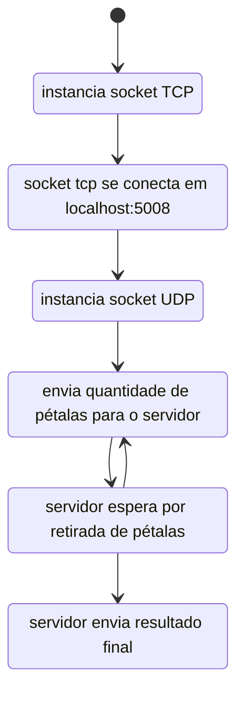

# bem-me-quer

"joguinho" que implementa TCP e UDP para a disciplina de greycomn

## diagrama de estado do client.py

## referências

- [Exemplo de cliente-servidor em python by pythonic](https://pythontic.com/modules/socket/udp-client-server-example)
- [Python socket docs](https://docs.python.org/3/library/socket.html#socket.socket.bind)

 
 
 

